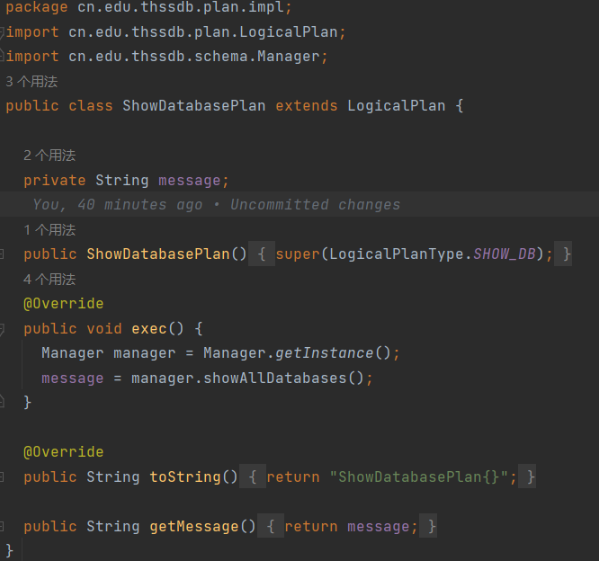

# ThssDB-2023


## 添加命令流程：

以`show databases`为例

1.在`cn/edu/thssdb/plan/impl/`目录下定义`ShowDatabasePlan`类，继承于`LogicalPlan`

* 将`ShowDatabasePlan`类对应的枚举类型 `SHOW_DB` 加入父类的枚举类型变量`LogicalPlanType`中


* 构造函数`ShowDatabasePlan()`是`ThssDBSQLVisitor.java`中生成对象时调用
* 函数`exec()`是在 `IServiceHandler` 中实现业务逻辑时调用



2.在`cn/edu/thssdb/parser/ThssDBSQLVisitor.java`中使用构造函数，将`LogicalPlan`生成对象(记得修改context)


3.在 `TransactionManager` (transaction文件夹下)中实现业务逻辑


4.启动 ThssDB 和 Client，执行测试代码：

```sql
connect root root;				
create database databaseName;	//创建已存在的数据库也会报错
show databases;					//注意s，是databases，不是database
```
## 20230403

**测试命令：**

```sql
connect root root;				
create database databaseName;	//创建已存在的数据库也会报错
show databases;					//注意s，是databases，不是database
drop database databaseName;
```

成功运行结果如截图


**实现命令如下：**

创建数据库

```sql
create database databaseName;
```

展示数据库

```sql
show databases;
```
## 20230404

**实现命令如下：**

创建用户

```sql
create user user1 identified by 'password' //注意单词拼写，注意单引号，例如这个语句创建的用户名密码对为(user1,'password')
```

用户登录

```sql
connect user1 'password';
```

切换数据库

```SQL
use dbName;
```

tips

关闭连接的命令最后要加‘；’否则不识别

## 20230406

常用测试命令

```sql
connect root root;
show databases;
use db1;

create table t1 ( c1 int primary key );
show table t1;
insert into t1 ( C1 ) values ( 1 );

create table t2 (c1 int, c2 int, c3 int,primary key(c1));
show table t2;
insert into t2 ( C1, C2, C3) values ( 1, 1, 1 );

create table t3 ( c1 float primary key ); 
show table t3;
insert into t3 ( C1 ) values ( 1.1 );

//已解决
create table t4 ( C1 string( 3 ) primary key ); 
show table t4;
insert into t4 ( C1 ) values ( '1'  );
```

## 20230519

### 测试模块的完善

#### 测试模块原理

这个测试类是用于测试 THSSDB 数据库的客户端 Client 类的功能是否正常。

在测试之前，会先启动客户端，连接到默认的服务器地址和端口，并测试连接是否正常。测试完成之后，会断开客户端连接

已经实现两种基本函数：

* `testFromHardCode()`测试硬编码在程序中基本的 SQL 语句（如 show databases 和 use testdb）

  

* `testFromFile`从文件中（默认为`"src/test/sql/test.sql"`）读取 SQL 语句并逐条执行。

  

#### 测试模块的使用

对于测试类的使用方法，需要在测试之前设置好 THSSDB 服务器的地址和端口。可以通过命令行参数来设置，也可以使用默认值。具体来说，可以使用以下命令行参数：

-h,--host <arg> Host (optional, default 127.0.0.1)
-p,--port <arg> Port (optional, default 6667)

其中 -h 或 --host 用于设置服务器地址，-p 或 --port 用于设置服务器端口，--help 用于显示帮助信息。如果不传入任何参数，则会使用默认值 127.0.0.1 和 6667。


使用该测试类时，需要先启动 THSSDB 服务器。


然后，在 IDE 中运行该测试类即可。

在测试过程中，可以观察控制台输出，以了解测试的进度和结果。

一个成功的样例：


## 《数据库原理》2023春大作业要求

https://apache-iotdb.feishu.cn/docx/EuVyd4o04oSHzZxRtBFcfRa0nab

## 《数据库原理》ThssDB2023 开发指南

https://apache-iotdb.feishu.cn/docx/RHnTd3Y3tocJQSxIIJFcDmlHnDd

## 大作业测试工具及要求的说明文档：
https://apache-iotdb.feishu.cn/docx/CJuRdLir5oBZOXxyvaJcwspWnOf